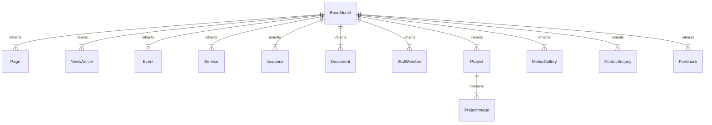

# OVPA Website & Content Management System (CMS) Overview

Comprehensive technical specification and architectural overview of the **Office of the Vice President for Administration (OVPA) Website & Content Management System (CMS)** for the University of the Philippines System.

---

## 📌 Executive Summary

The OVPA Website is an enterprise web application designed to deliver strategic leadership, administrative governance, public transparency, and digital services across the UP System. Built on modern Python/Django architecture, it integrates a public portal, dynamic page engine, multi-tier staff CMS dashboard, and serverless Vercel compatibility.

---

## 🛠️ Technology Stack Architecture

| Layer | Technology | Purpose & Details |
| :--- | :--- | :--- |
| **Backend Core** | **Python 3.12+ / Django 5.0** | Robust, secure MVC web framework handling routing, ORM database, authentication, and security middlewares. |
| **Database** | **SQLite3 (Dev) / PostgreSQL (Prod)** | Managed via `dj-database-url` and `psycopg2-binary`. Configured for connection pooling (`conn_max_age=600`). |
| **Rich Text Editor** | **django-ckeditor** | Integrated CKEditor 4 with upload handlers for dynamic HTML formatting in pages, news, services, and projects. |
| **Static & Media Asset Handling** | **WhiteNoise & Pillow** | WhiteNoise compresses and caches production static assets (`CompressedManifestStaticFilesStorage`); Pillow processes image uploads. |
| **Environment & Config** | **python-decouple** | Separates credentials and environment settings (`.env`). |
| **Server Interface & Hosting** | **WSGI / Gunicorn / Vercel** | Local execution via WSGI/Gunicorn; Serverless production deployment configured via `api/index.py` and `vercel.json`. |

---

## 🏗️ System Architecture & Data Models

The core business logic resides within the **`cms`** application ([cms/models.py](file:///c:/Users/ajbas/Documents/Apps/ovpa_website/cms/models.py)) and **`accounts`** user management application.



### 1. Abstract Base Architecture (`BaseModel`)
All CMS models inherit from `BaseModel`, providing:
* **Soft Delete Logic**: Soft-deletion (`is_deleted=True`, `deleted_at`) preserving database integrity while hiding archived content from the public portal.
* **Publishing Workflow**: Status states (`draft`, `review`, `published`, `archived`).
* **Audit Metadata**: Automated `created_at`, `updated_at`, and `created_by` foreign key tracking.

### 2. Core Entities & Data Schema

#### A. Dynamic Pages (`Page`)
* **Purpose**: Powers generic and structured institutional pages like `/about/`, `/page/quality-policy/`, `/page/vision/`, and `/page/mission/`.
* **Fields**: `title`, `slug` (unique identifier), `content` (Rich Text HTML), `meta_description` (SEO optimization up to 160 characters).
* **Special UI Capability**: Dynamic **Sticky Table of Contents Sidebar** automatically generated for any page containing `<h3>` headings.

#### B. Personnel & Organizational Directory (`StaffMember`)
* **Purpose**: Manages top management and administrative staff records displayed on `/office/`.
* **Fields**: `name`, `position`, `unit`, `is_top_management` (Boolean flag distinguishing Executive Leadership), `display_order`, `is_active`.
* **Groupings**:
  1. *Executive Leadership* (`is_top_management=True`)
  2. *Administrative Personnel* (`unit="OVPA"`)
  3. *OVPA-Quality Management System* (`unit="OVPA-Quality Management System"`)

#### C. News & Advisories (`NewsArticle`)
* **Purpose**: University news updates, announcements, and featured stories.
* **Fields**: `title`, `slug`, `excerpt`, `content` (Rich Text), `featured_image`, `published_date`, `is_featured` (Homepage carousel highlight).

#### D. Calendar & Events (`Event`)
* **Purpose**: Schedules workshops, meetings, conferences, and seminars.
* **Fields**: `title`, `description` (Rich Text), `start_datetime`, `end_datetime`, `location`, `event_type` (`meeting`, `conference`, `workshop`, `seminar`, `other`).

#### E. Administrative Services Catalog (`Service`)
* **Purpose**: ARTA / Citizen's Charter compliant directory of university services.
* **Fields**: `title`, `slug`, `service_category` (`internal`, `external`), `transaction_type` (`simple`, `complex`, `highly_technical`), `duration`, `description`, `where_to_secure`, `who_may_avail`, `classification` (e.g. G2G, G2C), `requirements`, `process`, `icon` (FontAwesome icon class), `display_order`.

#### F. Issuances & Policy Memos (`Issuance`)
* **Purpose**: Official policy releases, circulars, orders, and memoranda.
* **Fields**: `title`, `issuance_number` (Unique, e.g., `MEMO-2026-001`), `issuance_type` (`memo`, `circular`, `order`, `resolution`), `content`, `attachment` (PDF/Doc upload), `issuance_date`.

#### G. Document Repository (`Document`)
* **Purpose**: Downloadable resource library with categorized files.
* **Fields**: `title`, `description`, `document_file`, `category` (`forms`, `policies`, `reports`, `guidelines`, `templates`, `other`), `tags`, `download_count` (Auto-incremented on user download), `uploaded_by`.

#### H. Projects & Initiatives (`Project` & `ProjectImage`)
* **Purpose**: Major university transformational programs (e.g., SSPMO, SHRDO, SCO, OVPA-QMS).
* **Fields**: `title`, `slug`, `category`, `excerpt`, `content`, `featured_image`, with linked gallery images via `ProjectImage`.

#### I. Media Gallery (`MediaGallery`)
* **Purpose**: High-resolution image archives with captions and event dates.
* **Fields**: `title`, `description`, `image_file`, `published_date`.

#### J. Urgent Advisory Ticker Items (`AdvisoryTicker`)
* **Purpose**: Manages site-wide running announcements and urgent public advisories displayed on the top marquee bar.
* **Fields**: `text`, `category` (`notice`, `workshop`, `maintenance`, `emergency`, `general`), `link_url` (optional target URL), `is_active` (toggle active display), `display_order`.
* **CMS Location**: Registered under **Advisory Ticker Items** in Django Admin Console.

#### K. Public Inquiries & Feedback (`ContactInquiry` & `Feedback`)
* **Purpose**: Form submissions from stakeholders.
* **Fields**: Contact inquiry details with resolution status (`is_resolved`, `resolved_by`), and Feedback ratings (1-5 scale) with review flags (`is_reviewed`).

---

## 🖥️ Content Management System (CMS) Consoles

The website features **two distinct management interfaces**:

### 1. Technical Django Admin Console
* **URL**: [http://127.0.0.1:8000/admin/](http://127.0.0.1:8000/admin/)
* **Target Users**: System Administrators & IT Officers.
* **Capabilities**:
  * Complete database CRUD operations over all 12+ models.
  * Granular permissions, group access, and user role configuration (`accounts.User`).
  * Direct file/media uploads and CKEditor media asset server management.
  * Soft-delete restoration and audit log viewing.

### 2. Custom Staff Dashboard
* **URL**: [http://127.0.0.1:8000/dashboard/](http://127.0.0.1:8000/dashboard/)
* **Target Users**: Administrative Staff & Content Managers.
* **Capabilities**:
  * Streamlined publishing workflow without exposing database technicalities.
  * Dashboard statistics widget (total news, events, pending inquiries, pending feedback).
  * Direct forms to publish news articles, create events, and review public feedback/inquiries.

---

## 🌐 Navigation & URL Routing Map

```
/
├── admin/                     -> Technical Admin Console
├── dashboard/                 -> Staff CMS Dashboard
│
├── about/                     -> About OVPA Page (with Sticky Sidebar ToC)
├── page/
│   └── <slug>/                -> Dynamic Page Renderer (e.g., /page/quality-policy/)
│
├── news-updates/              -> Combined News & Events Hub
├── news/                      -> News Directory List
│   └── <slug>/                -> News Article Detail
├── events/                    -> University Calendar & Events List
│
├── office/                    -> Office Structure, Leadership & Staff Directory
│   └── <office_code>/         -> Sub-office Detail (SSPMO, SHRDO, SCO)
│
├── resources/                 -> Resources Landing Hub
│   ├── services/              -> Administrative Services Catalog (Filtered by Category)
│   │   └── <slug>/            -> Service Detail
│   ├── issuances/             -> Memos & Circulars List
│   ├── documents/             -> Downloadable Document Repository
│   ├── media-gallery/         -> Photo & Media Gallery
│   ├── statistics/            -> Public Dashboard & Statistics
│   └── faqs/                  -> Frequently Asked Questions
│
├── projects/                  -> Projects & Initiatives Hub
│   └── <slug>/                -> Project Case Study Detail
├── programs/                  -> Strategic Programs Overview
├── careers/                   -> Job Openings & Career Opportunities
├── contact/                   -> Contact Inquiry Form
└── feedback/                  -> Citizen Feedback Submission Form
```

---

## 🎨 UI/UX Design System & Key Features

1. **Theme Palette**: Authentic UP Maroon (`#7B1113`), UP Dark Maroon (`#4A0A0C`), and UP Gold (`#F8D677`) combined with crisp light backgrounds (`#F9FAFB`) and dark slate typography.
2. **Responsive Dynamic Side Navigation**:
   * Integrated into `templates/page.html`.
   * Automatically parses `<h3>` headings inside page content via JavaScript.
   * Generates a sticky sidebar with smooth scrolling anchor jumps and scroll-spy active state highlighting.
3. **Structured Policy Presentation**:
   * Special HTML formatting for the **UPSA Quality Policy & 7 Operational Drivers**.
   * Dedicated cards for **Kalinangán Code of Conduct** (Honor & Excellence).
   * Image modal links to high-resolution signed charters in `media/quality_values/`.
4. **Accessible Component Architecture**: Fully mobile-responsive navigation mega-menus, card grids, accessible typography, and standard breadcrumbs.

---

## 🚀 Data Seeding & Maintenance Scripts

The project includes specialized Python automation scripts to seed, update, and maintain database content:

* **[populate_quality_values.py](file:///c:/Users/ajbas/Documents/Apps/ovpa_website/populate_quality_values.py)**: Seeds the UPSA Quality Policy, 7 Operational Drivers, and Kalinangán Honor & Excellence charters into the database (`slug='quality-policy'`).
* **[update_about_content.py](file:///c:/Users/ajbas/Documents/Apps/ovpa_website/update_about_content.py)**: Populates the comprehensive About OVPA page (`slug='about'`) with section anchors (`#pillars`, `#history`, `#functions`, `#committees`, `#coordination`, `#strategic-goals`).
* **[populate_from_pdf.py](file:///c:/Users/ajbas/Documents/Apps/ovpa_website/populate_from_pdf.py)**: Seeds executive leadership, administrative personnel, and OVPA-QMS staff records into `StaffMember`.
* **[seed_actual_services.py](file:///c:/Users/ajbas/Documents/Apps/ovpa_website/seed_actual_services.py)**: Populates Citizen's Charter compliant administrative services.
* **[populate_content.py](file:///c:/Users/ajbas/Documents/Apps/ovpa_website/populate_content.py)**: Generates sample news articles, events, and media gallery items with placeholder images.

---

## 🔧 Installation & Local Development Setup

### 1. Requirements & Prerequisites
* Python 3.10+
* Virtual Environment (`venv`)

### 2. Environment Setup
```bash
# Clone and enter workspace directory
cd ovpa_website

# Activate virtual environment (Windows PowerShell)
.\venv\Scripts\Activate.ps1

# Install required packages
pip install -r requirements.txt
```

### 3. Database Migration & Data Seeding
```bash
# Apply migrations
python manage.py migrate

# Seed core database content
python update_about_content.py
python populate_quality_values.py
python populate_from_pdf.py
python seed_actual_services.py
```

### 4. Running Local Development Server
```bash
python manage.py runserver 8000
```
Access the application at [http://127.0.0.1:8000/](http://127.0.0.1:8000/).
